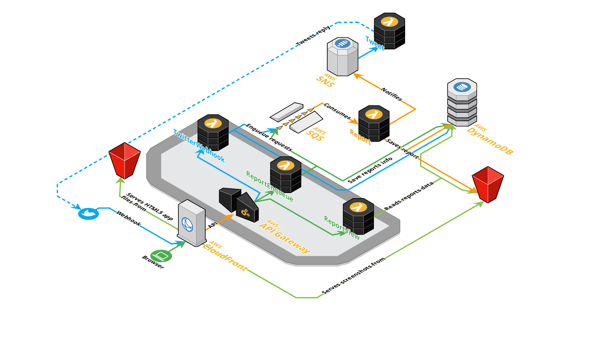

<h1>A11ygator</h1>

An application and Twitter bot that bites websites to taste their accessibility.

Infrastructure
--------------

* The app (static HTML+JS+CSS files) is stored on a bucket and is served via CloudFront.
* The screenshots are stored on another bucket, along with JSON reports, and are served via CloudFront (`/screenshots/*` path pattern)
* The API is configured via API Gateway, and proxied via CloudFront (`/api/*` path pattern)

### API Endpoints

- `GET /webhooks/twitter`: endpoint required by Twitter for webhooks, to pass Challenge Response Check (CRC).
- `POST /webhooks/twitter`: Twitter webhook that will receive payloads and selectively enqueue messages into the SQS Queue for reports to be generated.
- `POST /reports`: endpoint to manually enqueue a report generation.
- `GET /reports/{id}`: endpoint to obtain a generated report in either JSON or HTML format — it will return 404 until the report is ready.

### Background processing

* Report generation requests are sent to a SNS Queue.
* Enqueued messages are consumed by a Lambda function that loads the URL, waits for the configured amount of time, and runs Pa11y with the configured standard, then takes two screenshots (viewport and full-page), uploads the screenshots and the report JSON to an S3 bucket, and sends a notification to a SNS Topic.
* A Lambda function is listening for notifications of generated reports that were requested via Twitter, and tweets a reply by uploading the viewport screenshot to Twitter and attaching it to a Tweet that contains aggregate data and a link to the HTML report.
